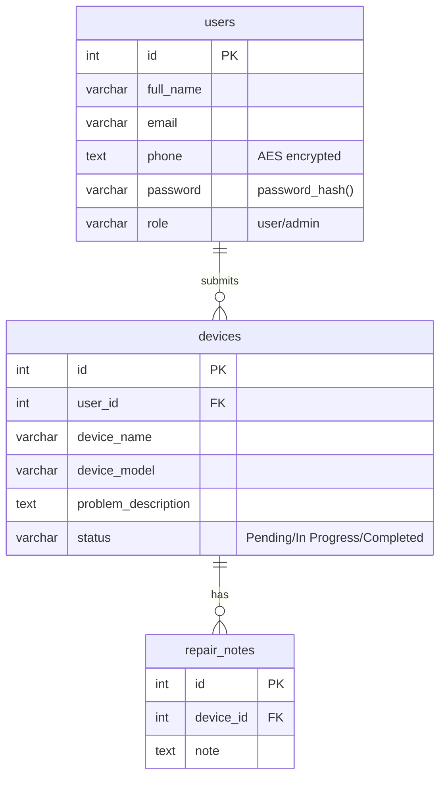

# Secure Mobile Maintenance Center Management System - System Architecture Diagram

This document provides a source-code-aligned architecture diagram for the **Secure Mobile Maintenance Center Management System**. It is intended for software engineering documentation, SSDLC review, academic project defense, and cybersecurity presentation use.

## Architecture Diagram

```mermaid
flowchart TB
    %% Secure Mobile Maintenance Center Management System
    %% Source-code-aligned layered architecture

    subgraph CL["1. Client Layer"]
        UB["User Browser\nActions: Registration, Login, Device Management, Status Tracking, Repair Notes Viewing"]
        AB["Administrator Browser\nActions: Login, Admin Dashboard, Users Management, Devices Management, Status Updates, Repair Notes"]
    end

    subgraph PL["2. Presentation Layer - PHP Views emitting HTML"]
        HOME["Home View\nviews/home.php route target"]
        REGISTER["Register View\nviews/auth/register.php\nHTML form: full_name, email, phone, password"]
        LOGIN["Login View\nviews/auth/login.php\nHTML form: email, password"]
        UDASH["User Dashboard\nviews/user/dashboard.php"]
        PROFILE["Profile\nviews/user/profile.php"]
        ADDDEV["Add Device\nviews/user/add-device.php\nHTML form: device_name, device_model, problem_description"]
        MYDEV["My Devices\nviews/user/my-devices.php\nStatus Tracking + Repair Notes + Edit/Delete links"]
        EDITDEV["Edit Device\nviews/user/edit-device.php"]
        DELDEV["Delete Device\nviews/user/delete-device.php"]
        ADASH["Admin Dashboard\nviews/admin/dashboard.php\nStatistics: users/devices/status counts"]
        ADEV["Devices Management\nviews/admin/devices.php"]
        AUSERS["Users Management\nviews/admin/users.php"]
        ASTATUS["Change Device Status\nviews/admin/change-device-status.php"]
        ANOTE["Add Repair Note\nviews/admin/add-repair-note.php"]
        CSSJS["CSS / JavaScript Presentation Assets\nNo dedicated external asset files detected; current UI is server-rendered HTML with browser form behavior"]
    end

    subgraph RWL["Web Server Rewrite Layer"]
        HTACCESS[".htaccess\nRewrite all non-file/non-directory requests to index.php?url=$1"]
    end

    subgraph RL["3. Routing Layer"]
        ROUTER["index.php\nRoute Resolution\nRequest Dispatching\nSecurity Headers"]
        ROUTES["Implemented Routes\n/, register, login, logout, dashboard, profile, add-device, my-devices, admin, admin/users, admin/devices, admin/notes, edit-device, delete-device, admin/change-device-status, add-repair-note"]
    end

    subgraph MLW["4. Middleware Layer"]
        AUTHMW["Authentication Middleware\nmiddleware/auth.php\nSession Validation: requires $_SESSION['user_id']"]
        ADMINMW["Admin Authorization Middleware\nmiddleware/admin.php\nSession Validation + Role Verification: $_SESSION['role'] === 'admin'"]
    end

    subgraph CLAYER["5. Controller Layer"]
        AUTHC["AuthController\ncontrollers/AuthController.php\nRegistration/Login Request Processing\nBusiness Logic Coordination\nInput Handling"]
        DEVC["DeviceController\ncontrollers/DeviceController.php\nAdd Device, My Devices, Update Device, Delete Device, Change Status, Get Repair Notes"]
        DIRECTVIEWS["Direct View-Level Handlers\nSome admin/user views instantiate models directly for status changes, repair notes, dashboard counts, ownership checks, and listings"]
    end

    subgraph MOL["6. Model Layer"]
        USERM["User Model\nmodels/User.php\nfindUserByEmail(), createUser(), getAllUsers(), getUsersCount()\nPrepared Statements for user lookup/create"]
        DEVM["Device Model\nmodels/Device.php\ncreateDevice(), getDevicesByUserId(), getDeviceById(), updateDevice(), deleteDevice(), getDeviceByIdAndUserId(), getAllDevices(), updateDeviceStatus(), addRepairNote(), getRepairNotes(), status/count queries\nPrepared Statements for parameterized operations"]
    end

    subgraph CFG["Configuration Layer"]
        DBCFG["config/database.php\nMySQL mysqli connection\nutf8mb4 charset"]
        SESCFG["config/session.php\nsession_start() when no active session"]
        ENCCFG["config/encryption.php\nAES-256-CBC encryptData()/decryptData()"]
        LOGOUT["logout.php\nsession_unset() + session_destroy()"]
    end

    subgraph DL["8. Data Layer - MySQL Database: secure_mobile_center"]
        USERS[("users\nid, full_name, email, encrypted phone, password hash, role")]
        DEVICES[("devices\nid, user_id, device_name, device_model, problem_description, status")]
        NOTES[("repair_notes\nid, device_id, note")]
        REL1["Relationship\nusers 1 : many devices"]
        REL2["Relationship\ndevices 1 : many repair_notes"]
    end

    subgraph SL["7. Dedicated Cross-Cutting Security Layer"]
        AUTHN["Authentication\nEmail/password login\npassword_verify()"]
        AUTHZ["Authorization + RBAC\nadmin role gate\nuser/admin route separation"]
        SESSION["Session Management\nsession_start()\nsession_regenerate_id(true) on login\nsession_unset()/session_destroy() on logout"]
        HASH["Password Hashing\npassword_hash(PASSWORD_DEFAULT)"]
        ENC["AES Encryption\nAES-256-CBC phone encryption\nrandom IV + base64 encoding"]
        INVAL["Input Validation\nrequired fields\nemail validation\nphone regex\nlength checks"]
        OUTSAN["Output Sanitization\nhtmlspecialchars() in dashboards, lists, device names, notes, and form values"]
        SQLSAFE["SQL Injection Control\nmysqli prepared statements + bind_param()"]
        HEADERS["HTTP Security Headers\nX-Frame-Options, X-Content-Type-Options, Referrer-Policy, X-XSS-Protection"]
        ACCESS["Access Control\nAuth middleware\nAdmin middleware\nOwner lookup with device_id + user_id in edit/delete paths"]
    end

    NOTE["Architecture Note\nSecurity Controls Implemented Across Multiple Layers:\nAuthentication Layer • Authorization Layer • Session Layer • Data Protection Layer"]

    %% Main Data Flow
    UB --> PL
    AB --> PL
    PL --> HTACCESS
    HTACCESS --> ROUTER
    ROUTER --> ROUTES

    %% Route dispatch to views
    ROUTES --> REGISTER
    ROUTES --> LOGIN
    ROUTES --> UDASH
    ROUTES --> PROFILE
    ROUTES --> ADDDEV
    ROUTES --> MYDEV
    ROUTES --> EDITDEV
    ROUTES --> DELDEV
    ROUTES --> ADASH
    ROUTES --> ADEV
    ROUTES --> AUSERS
    ROUTES --> ASTATUS
    ROUTES --> ANOTE

    %% Middleware gates
    UDASH --> AUTHMW
    PROFILE --> AUTHMW
    ADDDEV --> AUTHMW
    MYDEV --> AUTHMW
    EDITDEV --> AUTHMW
    DELDEV --> AUTHMW
    ADASH --> ADMINMW
    ADEV --> ADMINMW
    AUSERS --> ADMINMW
    ASTATUS --> ADMINMW
    ANOTE --> ADMINMW

    %% Controllers and direct handlers
    REGISTER --> AUTHC
    LOGIN --> AUTHC
    ADDDEV --> DEVC
    MYDEV --> DEVC
    EDITDEV --> DIRECTVIEWS
    DELDEV --> DIRECTVIEWS
    ADASH --> DIRECTVIEWS
    ADEV --> DIRECTVIEWS
    AUSERS --> DIRECTVIEWS
    ASTATUS --> DIRECTVIEWS
    ANOTE --> DIRECTVIEWS
    DEVC --> DEVM
    AUTHC --> USERM
    DIRECTVIEWS --> USERM
    DIRECTVIEWS --> DEVM

    %% Config dependencies
    AUTHMW --> SESCFG
    ADMINMW --> SESCFG
    LOGIN --> SESCFG
    LOGOUT --> SESCFG
    AUTHC --> ENCCFG
    USERM --> DBCFG
    DEVM --> DBCFG
    AUTHC --> DBCFG
    DEVC --> DBCFG
    DIRECTVIEWS --> DBCFG

    %% Data access
    USERM --> USERS
    DEVM --> DEVICES
    DEVM --> NOTES
    USERS --- REL1 --- DEVICES
    DEVICES --- REL2 --- NOTES

    %% Security controls crossing layers
    SL -. protects .-> CL
    SL -. protects .-> PL
    SL -. protects .-> RL
    SL -. protects .-> MLW
    SL -. protects .-> CLAYER
    SL -. protects .-> MOL
    SL -. protects .-> DL
    NOTE -. annotates .-> SL

    %% Security-control implementation links
    AUTHN -. implemented in .-> AUTHC
    AUTHZ -. enforced by .-> ADMINMW
    SESSION -. configured by .-> SESCFG
    HASH -. used by .-> AUTHC
    ENC -. used by .-> AUTHC
    INVAL -. used by .-> AUTHC
    INVAL -. used by .-> DEVC
    OUTSAN -. used by .-> PL
    SQLSAFE -. used by .-> USERM
    SQLSAFE -. used by .-> DEVM
    HEADERS -. set in .-> ROUTER
    ACCESS -. enforced by .-> AUTHMW
    ACCESS -. enforced by .-> ADMINMW
    ACCESS -. supported by .-> DEVM
```



## Database Relationship Diagram



## Main Request and Data Flow

```text
User Browser / Administrator Browser
        ↓
Presentation Layer: PHP views render HTML forms and pages
        ↓
Web Server Rewrite Layer: .htaccess forwards friendly URLs
        ↓
Routing Layer: index.php resolves URL and dispatches the matching view
        ↓
Middleware Layer: auth.php validates logged-in sessions; admin.php validates admin role
        ↓
Controller / View Handler Layer: AuthController, DeviceController, or direct view-level handlers process requests
        ↓
Model Layer: User and Device models execute database access logic through mysqli prepared statements
        ↓
Data Layer: MySQL database with users, devices, and repair_notes tables
```

## Implemented Security Controls Annotation

| Control | Implemented Location | Architecture Role |
| --- | --- | --- |
| `password_hash()` | `controllers/AuthController.php` registration flow | Stores passwords as hashes instead of plaintext. |
| `password_verify()` | `controllers/AuthController.php` login flow | Verifies submitted credentials against stored hashes. |
| AES Encryption | `config/encryption.php` and `controllers/AuthController.php` | Encrypts phone numbers before database storage. |
| Prepared Statements | `models/User.php`, `models/Device.php` | Protects parameterized user, device, status, and repair-note operations. |
| `session_start()` | `config/session.php` | Initializes PHP session state for authentication and authorization decisions. |
| `session_regenerate_id()` | `controllers/AuthController.php` login flow | Regenerates the session ID after successful authentication to reduce session-fixation risk. |
| RBAC | `middleware/admin.php` | Enforces admin-only access using the session role. |
| Authorization Checks | `middleware/auth.php`, `middleware/admin.php`, `models/Device.php` ownership lookup | Protects authenticated routes, admin routes, and user-specific device access. |
| `htmlspecialchars()` | User and admin views | Encodes dynamic output rendered into HTML. |
| HTTP Security Headers | `index.php` | Adds browser-side hardening headers before route dispatch. |

## Layer Notes

### Client Layer

- Regular users access registration, login, dashboard, profile, device submission, device listing, device editing, deletion, status tracking, and repair-note viewing through a browser.
- Administrators use a browser for login, dashboard statistics, users management, devices management, device status updates, and repair-note creation.

### Presentation Layer

- The project uses PHP view files under `views/` to generate HTML pages and forms.
- No dedicated external CSS or JavaScript asset files were detected in the current repository; the implemented user interface is currently server-rendered HTML with browser-native form behavior.

### Routing Layer

- Apache rewrite rules forward clean URLs to `index.php?url=...`.
- `index.php` performs route resolution using a `switch` statement and dispatches to the matching view.
- `index.php` also applies security headers.

### Middleware Layer

- `middleware/auth.php` requires an authenticated session for user routes.
- `middleware/admin.php` requires an authenticated session and the `admin` role for administrative routes.

### Controller Layer

- `AuthController` handles registration and login business logic.
- `DeviceController` handles several user-facing device workflows.
- Several view files instantiate models directly; this is represented as **Direct View-Level Handlers** to accurately reflect the implemented code rather than a fully centralized MVC controller design.

### Model Layer

- `User` encapsulates user lookup, creation, listing, and count queries.
- `Device` encapsulates device CRUD, ownership lookup, status updates, repair-note storage, repair-note retrieval, and device statistics.

### Security Layer

Security controls are implemented across multiple layers:

- **Authentication Layer:** login flow with `password_verify()`.
- **Authorization Layer:** authenticated route gates and admin RBAC.
- **Session Layer:** session initialization, session ID regeneration after login, and session destruction during logout.
- **Data Protection Layer:** password hashing, AES phone encryption, output encoding, prepared statements, and database charset configuration.

### Data Layer

- The application uses a MySQL database named `secure_mobile_center`.
- The implemented data model centers on `users`, `devices`, and `repair_notes`.
- The logical relationships are `users` 1-to-many `devices`, and `devices` 1-to-many `repair_notes`.
